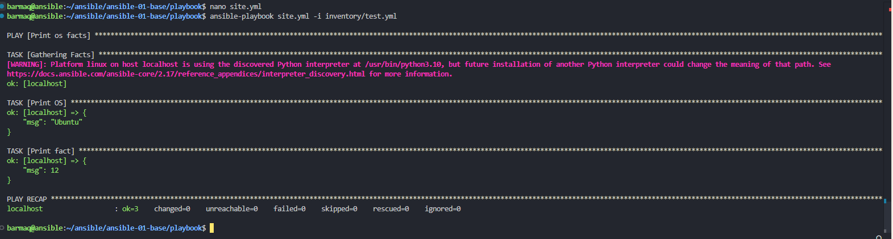

**Основная часть**

1.Попробуйте запустить playbook на окружении из test.yml, зафиксируйте значение, которое имеет факт some_fact для указанного хоста при выполнении playbook.
	
проверяем плейбук   
**nano site.yml**  
видим что факт **some_fact** выводится с помощью **debug** и названием таски **Print fact**  
соответсвенно   
**ansible-playbook site.yml -i inventory/test.yml**

	TASK [Print fact] **********************************************************************************************************************************************************************************************************
	ok: [localhost] => {
		"msg": 12
	}		

**some_fact = 12**	

----------------------	
		
**2**.Найдите файл с переменными (**group_vars**), в котором задаётся найденное в первом пункте значение, и поменяйте его на **all default fact**.  
в папке **group_vars** ищем тот yaml у который нам подходит. в нашем случае "**all**"  
применяем 

**ansible-playbook site.yml -i inventory/test.yml**  
видим что вывод теперь   

	TASK [Print fact] 							**********************************************************************************************************************************************************************************************************
	ok: [localhost] => {
		"msg": "all default fact."
	}

----------------------	
	
**3**.Воспользуйтесь подготовленным (используется **docker**) или создайте собственное окружение для проведения дальнейших испытаний.

пришлось поставить ansible под root

запускаем контейнеры для ansible

**sudo docker run -dit --name centos7 pycontribs/centos:7 sleep 6000000  
sudo docker run -dit --name ubuntu pycontribs/ubuntu:latest sleep 6000000**

----------------------	

**5**.Проведите запуск playbook на окружении из **prod.yml**. Зафиксируйте полученные значения **some_fact** для каждого из managed host.

запускаем плейбук  
**sudo ansible-playbook site.yml -i inventory/prod.yml**

	ok: [ubuntu]
	ok: [centos7]

	TASK [Print OS] ************************************************************************************************************************************************************************************************************
	ok: [centos7] => {
		"msg": "CentOS"
	}
	ok: [ubuntu] => {
		"msg": "Ubuntu"
	}

	TASK [Print fact] **********************************************************************************************************************************************************************************************************
	ok: [centos7] => {
		"msg": "el"
	}
	ok: [ubuntu] => {
		"msg": "deb"
	}

	PLAY RECAP *****************************************************************************************************************************************************************************************************************
	centos7                    : ok=3    changed=0    unreachable=0    failed=0    skipped=0    rescued=0    ignored=0   
	ubuntu                     : ok=3    changed=0    unreachable=0    failed=0    skipped=0    rescued=0    ignored=0   

----------------------	

**5**. Добавьте факты в **group_vars** каждой из групп хостов так, чтобы для **some_fact** получились значения: для deb — **deb default fact**, для el — **el default fact**.

меняем значения переменной в папке group_vars в соответсвующих файлах 	**deb\examp.yml** и **el\examp.yml**

----------------------	
	
**6**. Повторите запуск playbook на окружении prod.yml. Убедитесь, что выдаются корректные значения для всех хостов.

**sudo ansible-playbook site.yml -i inventory/prod.yml**

----------------------	

**7**. При помощи ansible-vault зашифруйте факты в **group_vars/deb** и **group_vars/el** с паролем **netology**.

**ansible-vault encrypt group_vars/deb/examp.yml   
ansible-vault encrypt group_vars/el/examp.yml** 

----------------------	

**8**.Запустите playbook на окружении **prod.yml**. При запуске ansible должен запросить у вас пароль. Убедитесь в работоспособности.

**sudo ansible-playbook site.yml -i inventory/prod.yml --ask-vault-pass**

----------------------	

**9**.Посмотрите при помощи ansible-doc список плагинов для подключения. Выберите подходящий для работы на control node.

получим список плагинов подключения  
**ansible-doc -t connection -l**
 для работы на control node ( т е прямо на сервере ansible ) мы используем плагин   
**ansible.builtin.local**   -       **execute on controller**   

----------------------	 

**10**.В **prod.yml** добавьте новую группу хостов с именем local, в ней разместите localhost с необходимым типом подключения. 
добавляет в указанный файл блок 

	  local:
	    hosts:
	      localhost:
	        ansible_connection: local

----------------------	 
	
**11**.Запустите playbook на окружении **prod.yml**. При запуске ansible должен запросить у вас пароль. Убедитесь, что факты **some_fact** для каждого из хостов определены из верных group_vars.

**sudo ansible-playbook site.yml -i inventory/prod.yml --ask-vault-pass**

----------------------

**Необязательная часть**

**12**.При помощи ansible-vault расшифруйте все зашифрованные файлы с переменными

**ansible-vault decrypt group_vars/deb/examp.yml   
ansible-vault decrypt group_vars/el/examp.yml**

----------------------

**13**.Зашифруйте отдельное значение **PaSSw0rd** для переменной **some_fact** паролем **netology**. Добавьте полученное значение в **group_vars/all/exmp.yml**

**ansible-vault encrypt_string**
пароль хранилища :
 **netology**
значение :
 **PaSSw0rd**

	Encryption successful
	!vault |
	          $ANSIBLE_VAULT;1.1;AES256
	          62653165343134353566656238636636663361323466396434666536373665333765396564383635
	          3731616462633639346563326333343731616439326461640a386638383039613637323738336331
	          61616536646332366633363136636339643235626533326564386333646235626332363530356366
	          6364346237326465320a623465666333643930303762356433316264356431376462343833613664
	          6462

вставляем полученный результат в значение переменной **some_fact** в файле **group_vars/all/exmp.yml**

----------------------

**14**.Запустите playbook, убедитесь, что для нужных хостов применился новый fact.

**sudo ansible-playbook site.yml -i inventory/prod.yml --ask-vault-pass**

----------------------

**15**.Добавьте новую группу хостов fedora, самостоятельно придумайте для неё переменную. В качестве образа можно использовать этот вариант.

**sudo docker run -dit --name fedora pycontribs/fedora:latest sleep 6000000**

добавляем в **inventory/prod** в **prod.yaml** соответсвующий блок

	  fedora:
	    hosts:
	      fedora:
	        ansible_connection: docker

добавляем в group_vars папку fedora , создаем example.yaml

	---
	  some_fact: "fedora default fact"

применяем  
**sudo ansible-playbook site.yml -i inventory/prod.yml --ask-vault-pass**  
видим что все поднялось
 
 
**16**.Напишите скрипт на **bash**: автоматизируйте поднятие необходимых контейнеров, запуск ansible-playbook и остановку контейнеров.

пишем простой скрипт **facts.sh** . скрипт без проверок на ошибки  и конфликты ( например если контейнеры уже существуют ). пароль от хранилища придется ввести во время исполнения скрипта! ведь так и задумано ( или я неправильно понял? ).
если нужна будет полная автоматизация то нужно использовать файл с паролем и запускать плейбоук с **--vault-password-file** вместо **--ask-vault-pass**

даем права на выполнение   
**chmod +x facts.sh**

запускаем обязательно от sudo  ( docker установлен под **root** )  
**sudo ./facts.sh**

